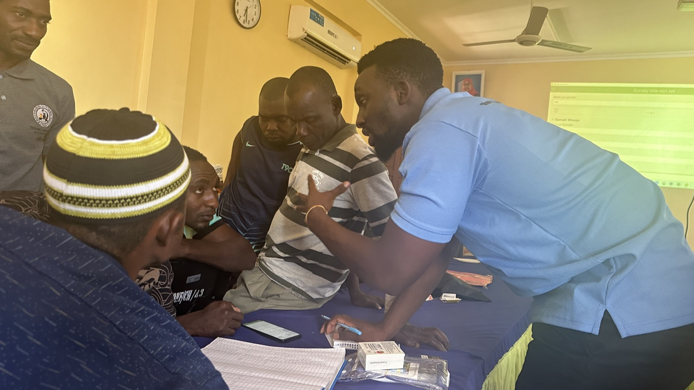
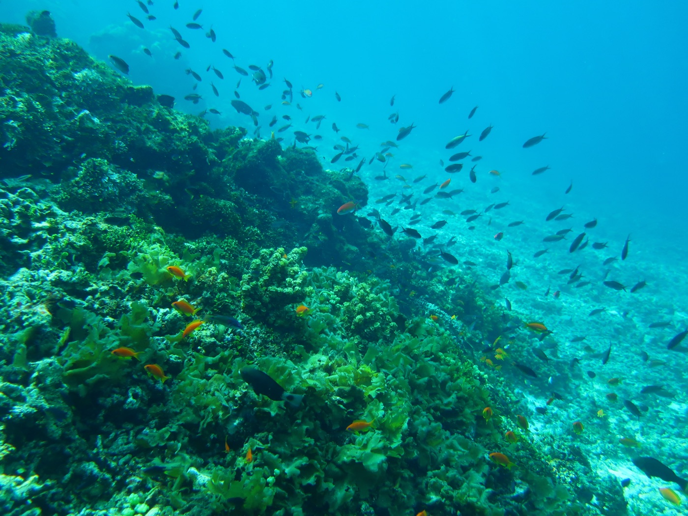
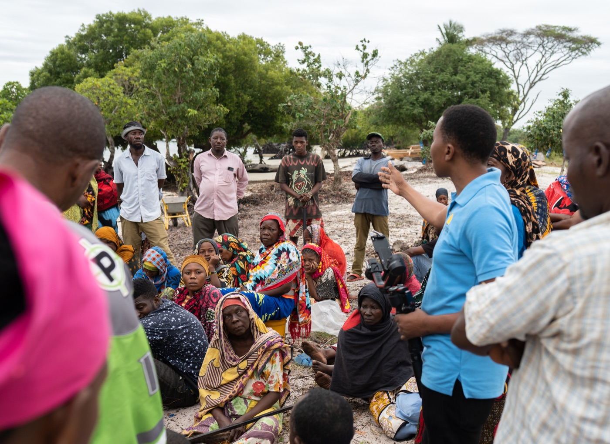
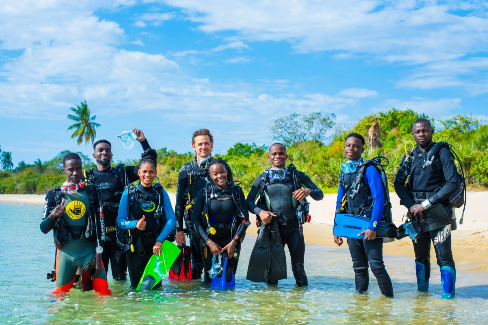
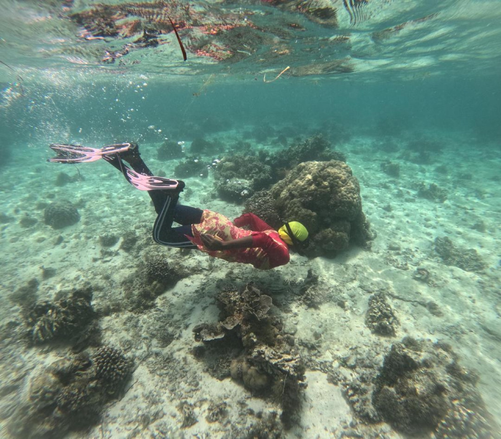
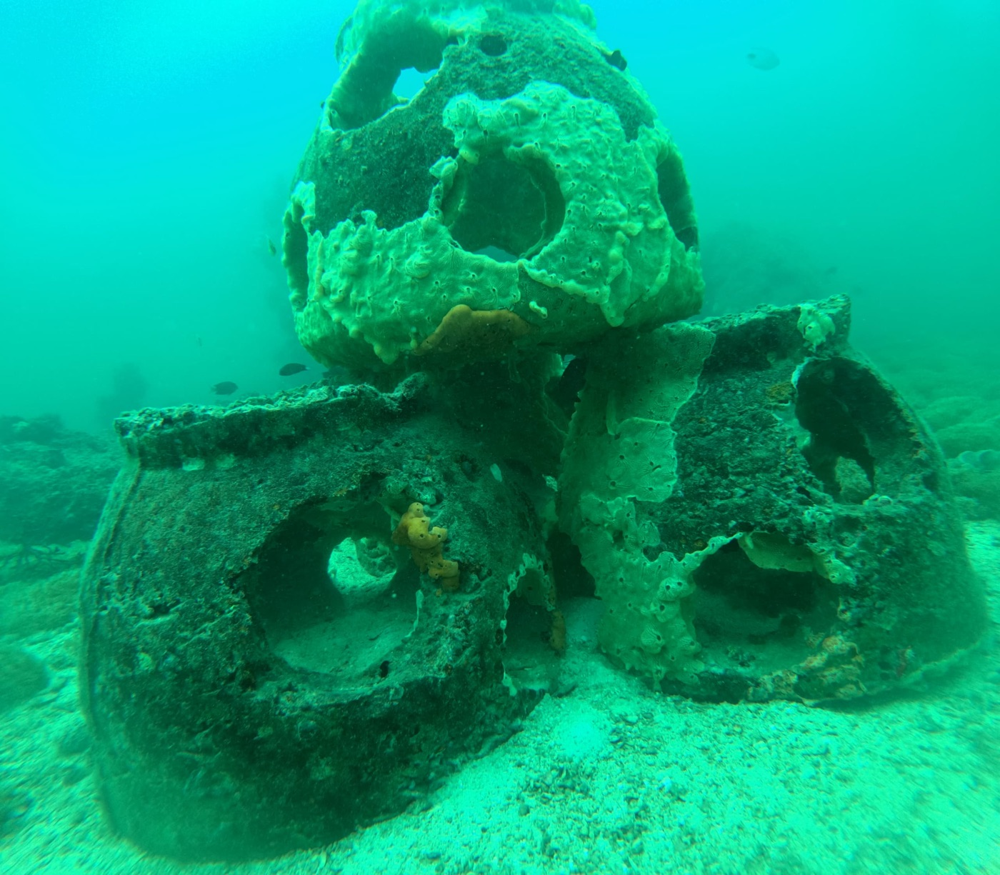
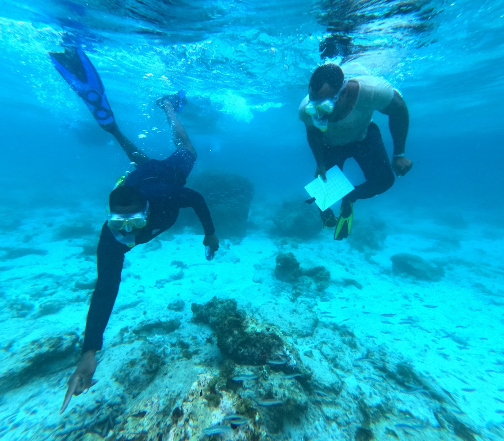

```{=html}
<div class="page-hero">
  <p class="hero-tagline">From the reef to the community — real outcomes on the Swahili Coast</p>
</div>
```

## Work on the Ground

My conservation work spans 50 communities across Zanzibar and the Tanga region of Northern Tanzania. Every protocol I design, every dataset I analyse, and every person I train is part of a connected effort to put ecological evidence at the centre of coastal management decisions.

---

## Key Impact Areas

::: {.impact-grid}

::: {.impact-area-card}
### 👥 Community Training — Fisheries Data Collection

Trained **200 community members** across **50 communities** (Zanzibar and Tanga region) on fisheries data collection protocols covering **reef fish, prawns, and octopus**. Training equipped local fishers with the skills to systematically record catch and effort data, turning everyday fishing activity into a conservation monitoring tool.

**Outcomes:**
- 200 trained community monitors actively collecting fisheries data
- 50 communities covered across Zanzibar and Northern Tanzania
- Community-generated data fed directly into **local management plans and adaptive management decisions**
- Increased local ownership of fisheries resource management
:::

::: {.impact-area-card}
### 🤿 In-Water Monitoring — Coral Reef Visual Census

Trained **300+ in-water monitors** in underwater visual census (UVC) techniques for coral reef monitoring, including data collection and analysis. A landmark achievement: **70 of these monitors are women** — breaking a significant cultural barrier in coastal Tanzania, where women's participation in snorkelling and underwater activities is highly unconventional.

**Outcomes:**
- 300+ trained underwater visual census monitors
- **70 women trained** as in-water monitors — unprecedented in this region
- Training extended beyond data collection to include **analysis of survey data**
- Results used to guide and support **coral reef restoration efforts**
:::

::: {.impact-area-card}
### 🪸 Coral Reef Restored Area

Provided data analysis and monitoring support for the restoration of **347 hectares of coral reef restored area**, including the deployment of **1,300 artificial reef structures**. This work involved designing data collection protocols, coordinating field surveys, and analysing reef health data to track restoration progress.

**Outcomes:**
- 347 ha of coral reef area restored and monitored
- 1,300 artificial reef structures deployed and tracked
- Reef health data used to measure restoration effectiveness
- Monitoring protocols adapted for long-term community fish replenishment zone management
:::

::: {.impact-area-card}
### 🌿 Mangrove Restoration & Seagrass Monitoring

Supported the restoration of approximately **60 hectares of mangrove habitat** through data collection protocol design and analysis. Also led seagrass monitoring surveys contributing to understanding of coastal habitat connectivity and ecosystem health.

**Outcomes:**
- 60 ha of mangrove area supported through data-driven restoration
- Seagrass monitoring integrated into multi-habitat coastal assessment
- Restoration progress tracked with standardised protocols
- Data informing coastal ecosystem management decisions
:::

::: {.impact-area-card}
### 📋 Protocols & Survey Tools

Developed **Mwambao's second fish catch monitoring data protocol** — a landmark institutional tool that standardises fisheries data collection across the organisation's entire network. Created **10+ ecological survey forms** covering all major survey types used by the ecological department.

**Outcomes:**
- New fish catch monitoring protocol in active use across the network
- 10+ survey forms designed for reef fish, coral, seagrass, mangrove, and octopus monitoring
- Standardised data collection reducing errors and improving comparability
- Institutional data quality significantly improved
:::

::: {.impact-area-card}
### 📊 Ecological Data Analysis

Led **all ecological data analysis** for Mwambao's ecological department — spanning fisheries, mangrove restoration, seagrass monitoring, and coral reef monitoring. Transforming raw field data from across the network into findings that drive conservation planning and adaptive management.

**Outcomes:**
- End-to-end analysis across four ecosystem monitoring programmes
- Annual reports and internal dashboards produced for each programme
- Data-driven adaptive management recommendations delivered to teams
- Analytical pipelines built in R for reproducible, efficient reporting
:::

:::

---

## Field Photos

```{=html}
<div class="photo-gallery">

  <div class="photo-item">
    
    <div class="photo-caption">Fisheries data collection training — teaching community monitors to record reef fish, prawn and octopus catch data</div>
  </div>

  <div class="photo-item">
    
    <div class="photo-caption">A healthy reef ecosystem — the kind of biodiversity our monitoring programmes track and protect</div>
  </div>

  <div class="photo-item">
    
    <div class="photo-caption">Community engagement session — working with fishing communities to co-design monitoring approaches and management plans</div>
  </div>

  <div class="photo-item">
    
    <div class="photo-caption">Tanzania DiveLab participants — AFO's Ocean Access Program creating equitable access to the ocean for marine scientists and conservation practitioners</div>
  </div>

  <div class="photo-item">
    
    <div class="photo-caption">One of 70 women trained as in-water monitors — conducting a reef survey, breaking cultural barriers in coastal Tanzania where women's participation in underwater activities is highly unconventional</div>
  </div>

  <div class="photo-item">
    
    <div class="photo-caption">Artificial reef structures deployed on the seabed — coral colonisation already visible on the structures, part of 1,300 deployed across restored reef areas</div>
  </div>

  <div class="photo-item">
    
    <div class="photo-caption">Trained community in-water monitors conducting underwater visual census — recording reef fish species, abundance and size on waterproof datasheets</div>
  </div>

</div>
```

---

## Professional Journey

*A timeline of roles, projects, and milestones across Tanzania's coastal conservation sector.*

```{=html}
<div class="timeline">

  <div class="timeline-item left">
    <div class="timeline-content">
      <span class="timeline-year">2021 – 2023</span>
      <h3>Research Assistant — BIOEEL-TZ, University of Dar es Salaam</h3>
      <p>Conducted fish biodiversity data collection and analysis, environmental parameter monitoring, and community capacity building workshops. Supported international conference reporting and co-produced a scientific documentary on anguillid eels in Tanzania as narrator and field researcher.</p>
    </div>
  </div>

  <div class="timeline-item right">
    <div class="timeline-content">
      <span class="timeline-year">2023 – 2026</span>
      <h3>Ecological Data Manager — Mwambao Coastal Community Network</h3>
      <p>Took on the full ecological data management role at Mwambao — designing monitoring protocols, leading community training across 50 communities, building data pipelines in R, and producing annual reports across fisheries, coral reef, mangrove, and seagrass programmes.</p>
    </div>
  </div>

  <div class="timeline-item left">
    <div class="timeline-content">
      <span class="timeline-year">2023 – 2024</span>
      <h3>Communications Manager — Sustainable Ocean Alliance Tanzania</h3>
      <p>Served as Communications Manager for SOA Tanzania — mobilising members, facilitating onboarding, bridging leadership and community members, and promoting active participation in ocean conservation programmes.</p>
    </div>
  </div>

  <div class="timeline-item right">
    <div class="timeline-content">
      <span class="timeline-year">2026 – Present</span>
      <h3>Marine Ecology Officer — The Nature Conservancy</h3>
      <p>Joined The Nature Conservancy as Marine Ecology Officer, leading fieldwork coordination, data collection protocols, and stakeholder engagement under the Pamoja Tuhifadhi Bahari Yetu project — working across Mtwara and Unguja North to strengthen marine co-management and biodiversity conservation.</p>
    </div>
  </div>

</div>
```

---

## By the Numbers

```{=html}
<div class="stats-grid">
  <div class="stat-box">
    <div class="stat-number">200</div>
    <div class="stat-desc">Community members trained in fisheries data collection</div>
  </div>
  <div class="stat-box">
    <div class="stat-number">50</div>
    <div class="stat-desc">Communities reached across Zanzibar & Tanga region</div>
  </div>
  <div class="stat-box">
    <div class="stat-number">300+</div>
    <div class="stat-desc">In-water monitors trained in underwater visual census</div>
  </div>
  <div class="stat-box">
    <div class="stat-number">70</div>
    <div class="stat-desc">Women trained as in-water monitors — breaking cultural barriers</div>
  </div>
  <div class="stat-box">
    <div class="stat-number">347 ha</div>
    <div class="stat-desc">Coral reef area restored and monitored</div>
  </div>
  <div class="stat-box">
    <div class="stat-number">1,300</div>
    <div class="stat-desc">Artificial reef structures deployed and tracked</div>
  </div>
  <div class="stat-box">
    <div class="stat-number">60 ha</div>
    <div class="stat-desc">Mangrove habitat supported through restoration data work</div>
  </div>
  <div class="stat-box">
    <div class="stat-number">10+</div>
    <div class="stat-desc">Ecological survey forms designed across all ecosystem types</div>
  </div>
</div>
```

---

## Partners & Collaborators

::: {.partners-row}
- **The Nature Conservancy** — current employer, Pamoja Tuhifadhi Bahari Yetu project
- **Mwambao Coastal Community Network** — ecological data management and community programmes
- **Sustainable Ocean Alliance Tanzania** — communications and member engagement
- **EU Commission Tanzania** — Youth Sounding Board advisory member
- **University of Dar es Salaam / BIOEEL-TZ** — research and documentary production
- **Coastal fishing communities** — Zanzibar and Tanga region (50 communities)
- **Local Government Authorities** — management plan integration and marine spatial planning
:::
